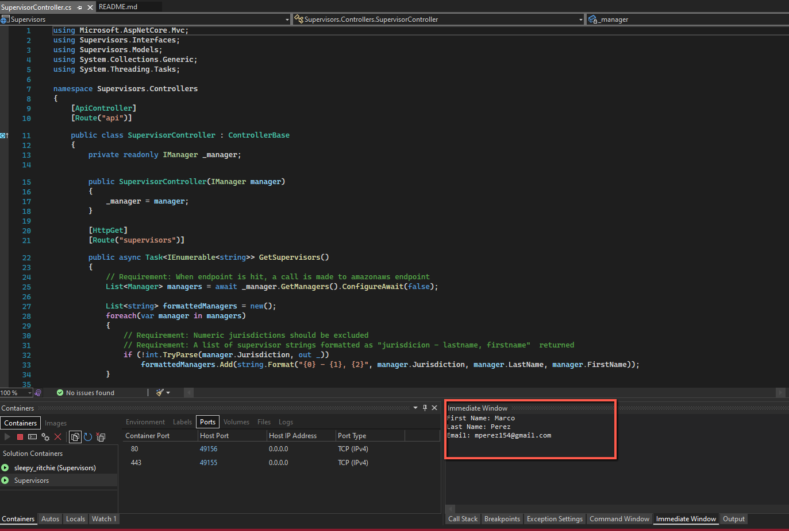
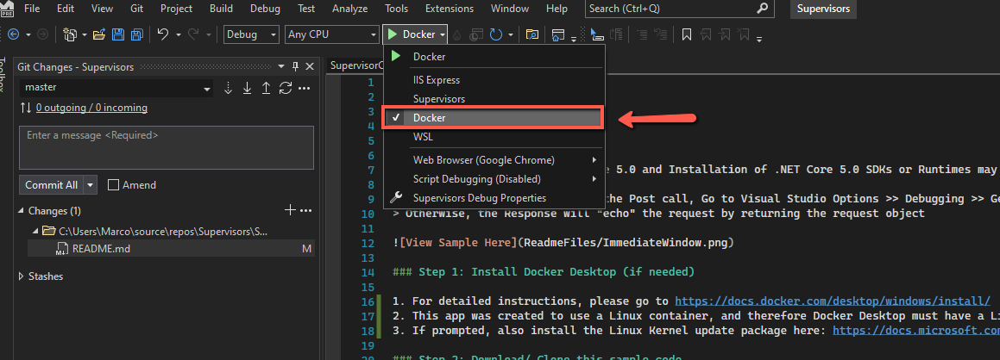

# Pre-Requisites 

> This sample is for ASP.NET Core 5.0 and Installation of .NET Core 5.0 SDKs or Runtimes may be required. If so, you can download and install them here: https://dotnet.microsoft.com/download/dotnet/5.0.

> To see the Console Output for the Post call, Go to Visual Studio Options >> Debugging >> General, then check the box that says 'Redirect all output Window text to the Immediate Window'. At that point you can view console output in the immediate window.
> Otherwise, the Response will "echo" the request by returning the request object 

### Step 1: Install Docker Desktop (if needed)

1. For detailed instructions, please go to https://docs.docker.com/desktop/windows/install/
2. This app was created to use a Linux container, and therefore Docker Desktop must have a Linux image available
3. If prompted, also install the Linux Kernel update package here: https://docs.microsoft.com/en-us/windows/wsl/install-manual#step-4---download-the-linux-kernel-update-package

### Step 2: Download/ Clone this sample code 

1. Project URL: https://github.com/mperez154/Supervisors
2. Clone URL: https://github.com/mperez154/Supervisors.git

### Step 3: Run the sample

1. Before building, ensure that 'Docker' is selected (see screenshot below)
2. Build the solution and run it.

### Step 4: Test the App (3 options)

#### Option 1

1. Download and the postman collection provided in the PostmanTestCollection folder of this project (source controlled for convenience)
2. Import collection into Postman, then open each request and run it

#### Option 2

1. Open the default browser on your PC, then enter the URL for one of the endpoints, and you should see a response. Repeat for the other endpoint.

#### Option 3

1. This app was setup with Swagger, and when you first launch the app, the swagger page should be opened, allowing you to test directly there. 

